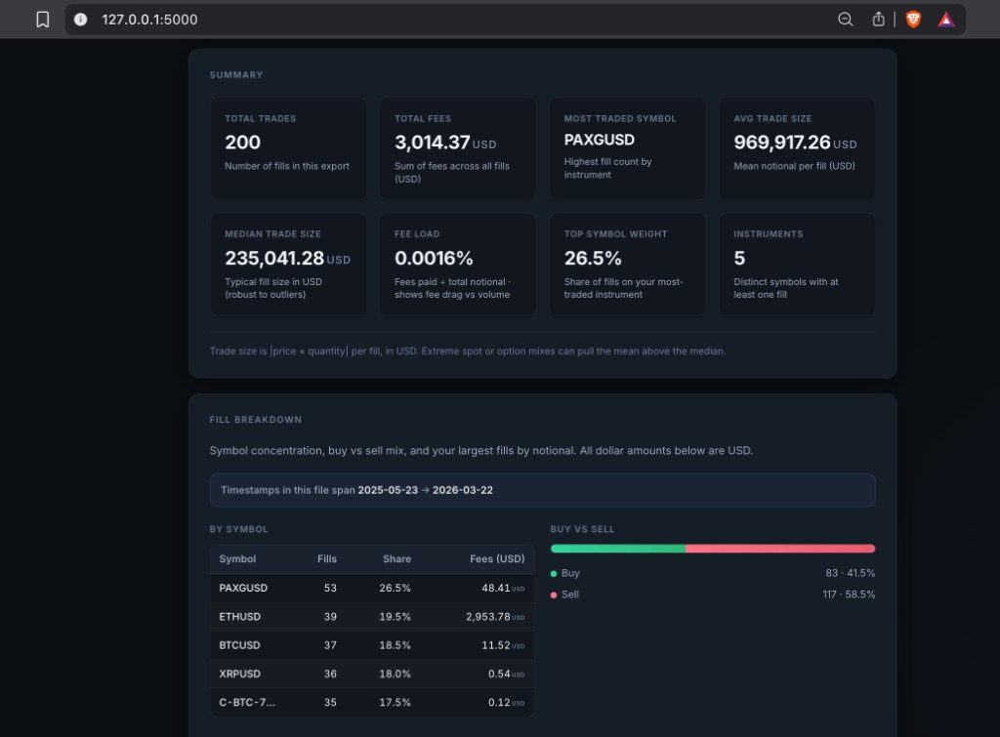
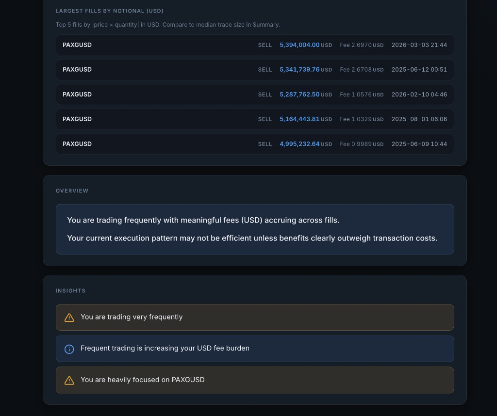
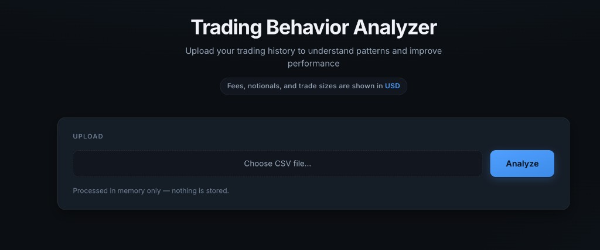

# 📊 Trading Behavior Analyzer

Analyze trading behavior from exchange fill data and identify patterns like **overtrading**, **fee impact**, and **concentration**.

**Author:** Madanraj

> ⚠️ **Disclaimer:** This tool is for **education and self-reflection only**. It is **not** financial, tax, or investment advice. Amounts are shown as **USD labels** in the UI (aligned with typical Delta-style exports); the app does not convert currencies.

---

## ✨ Features

| Feature | Description |
|--------|-------------|
| 📁 **CSV upload** | **[Delta Exchange Fill History](https://www.delta.exchange/)**-oriented parsing (works with similar exports too) |
| 📈 **Summary metrics** | Trades, fees, notionals, fee load, concentration, instruments |
| 🏷️ **Per-symbol breakdown** | Fill counts, share of activity, fees by symbol |
| 💸 **Fee analysis** | Total fees, fees vs total notional (**fee load %**) |
| 🔝 **Largest trades** | Top fills by notional (|**price × quantity**|) with time when available |
| 🧠 **Behavior insights** | Heuristics for frequency, fee drag, symbol focus, sizing patterns |

---

## 📸 Screenshots

### Dashboard



### Largest Fills



### Upload



---

## 🚀 How to run

```bash
pip install -r requirements.txt
python app.py
```

Then open **http://127.0.0.1:5000** in your browser.

- **Python:** 3.9+ recommended  
- **Upload limit:** 16 MB (see `app.py`)

---

## 🛠️ Tech stack

- **Python**
- **Flask** — web app & routing  
- **Pandas** — CSV parsing & analytics  

---

## 💡 Example insights

The UI may surface messages such as:

- Frequent trading increases **USD fee burden**
- Activity **concentrated** in one symbol  
- **Large fills** stand out vs median size (exposure / outliers)

Exact text depends on your export.

---

## 📂 Project structure

```
trading-insight-tool/
├── app.py              # Flask entry, routes, config
├── parser.py           # CSV → normalized DataFrame (column mapping, timestamps)
├── insights.py         # Metrics, breakdown, behavior heuristics
├── requirements.txt
├── screenshots/        # UI images referenced in README
├── docs/               # Optional extra docs
├── templates/
│   └── index.html      # Single-page UI (HTML + CSS)
└── README.md
```

---

## 🔒 Privacy

Uploads are processed **in memory** for the request; nothing is persisted by default unless you change the code or deployment.

---

## 📄 License

[MIT](LICENSE) — see [`LICENSE`](LICENSE).

**Repository:** [github.com/Madanraj-Delta/trading-behavior-analyzer](https://github.com/Madanraj-Delta/trading-behavior-analyzer)
